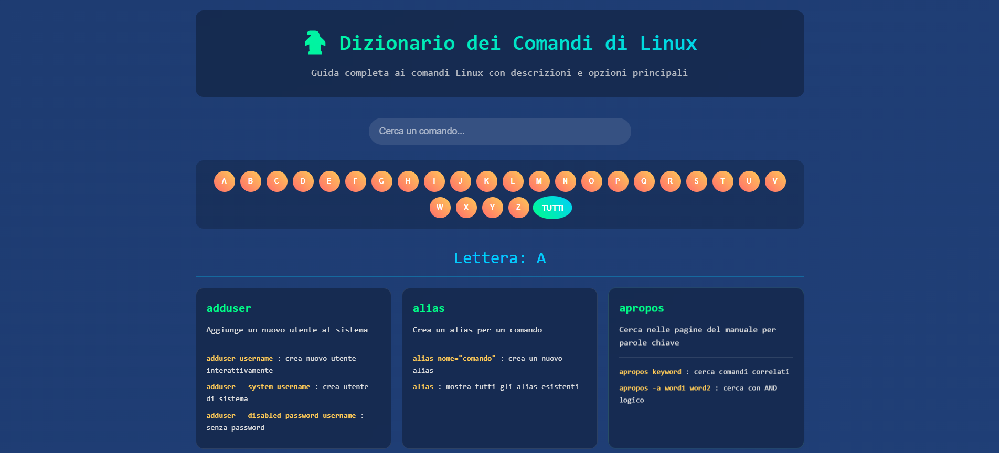

# 🐧 Dizionario dei comandi di Linux



<div align="center">


*Una guida completa ai comandi essenziali di Linux per sviluppatori e amministratori di sistema*

[](LICENSE)

</div>

---

## 📋 Indice

- [🔗 Link](#-link)
- [🔍 Panoramica](#-panoramica)
- [📚 Categorie di Comandi](#-categorie-di-comandi)
- [🚀 Come Utilizzare questa Guida](#-come-utilizzare-questa-guida)
- [⬇️ Download e Installazione](#️-download-e-installazione)
- [🤝 Contribuire](#-contribuire)
- [📄 Licenza](#-licenza)

---

## 🔗 Link

il sito è disponibile a questo link: https://nardix.github.io/Dizionario-comandi-linux/

## 🔍 Panoramica

Questo repository contiene una collezione organizzata dei comandi Linux più utilizzati, con spiegazioni dettagliate ed esempi pratici. Perfetto per:

- 👨‍💻 **Sviluppatori** che vogliono padroneggiare il terminale
- 🔧 **Amministratori di sistema** che cercano riferimenti rapidi
- 🎓 **Studenti** che stanno imparando Linux
- 💼 **Professionisti IT** che necessitano di una guida di riferimento

## 📚 Categorie di Comandi

<table>
<tr>
<td align="center" width="33%">

### 📁 **Gestione File**
Operazioni su file e directory
- `ls`, `cd`, `mkdir`
- `cp`, `mv`, `rm`
- `find`, `locate`

</td>
<td align="center" width="33%">

### 🔍 **Ricerca e Filtri**
Strumenti per trovare e processare dati
- `grep`, `awk`, `sed`
- `sort`, `uniq`, `wc`
- `head`, `tail`

</td>
<td align="center" width="33%">

### 🔧 **Amministrazione**
Gestione sistema e processi
- `ps`, `top`, `htop`
- `kill`, `killall`
- `systemctl`, `service`

</td>
</tr>
<tr>
<td align="center" width="33%">

### 🌐 **Networking**
Comandi di rete e connettività
- `ping`, `wget`, `curl`
- `netstat`, `ss`
- `iptables`, `ufw`

</td>
<td align="center" width="33%">

### 👥 **Utenti e Permessi**
Gestione utenti e autorizzazioni
- `chmod`, `chown`
- `su`, `sudo`
- `passwd`, `useradd`

</td>
<td align="center" width="33%">

### 📦 **Archivi e Compressione**
Gestione archivi e backup
- `tar`, `gzip`, `zip`
- `rsync`, `scp`
- `dd`, `mount`

</td>
</tr>
</table>

## 🚀 Come utilizzare questa Guida

### 📖 Struttura dei Comandi

Ogni comando appare in questo modo:

- **Nome del comando**
- **Breve descrizione**
- **lista di opzioni possibili**

### 🔎 Ricerca Rapida

- **Barra di ricerca dinamica**: Digita per cercare il comando o delle lettere al suo interno
- **Per lettera**: Clicca sulla lettera per cercare i comandi con quella iniziale

### 💡 Suggerimenti per Principianti

> 🚨 **Attenzione**: Alcuni comandi possono modificare o eliminare dati. Testa sempre in un ambiente sicuro!

- Inizia con i comandi base della sezione "Gestione File"
- Usa `man comando` per accedere al manuale completo
- Pratica in una macchina virtuale o container Docker

## ⬇️ Download e Installazione

### 🌐 Modalità 1: Utilizzo Locale (Raccomandato)

#### 📥 **Step 1: Scarica il Progetto**

```bash
# Clona il repository
git clone https://github.com/Nardix/Dizionario-comandi-linux.git

# Entra nella directory
cd Dizionario-comandi-linux
```

**Oppure scarica il ZIP:**
1. Clicca sul pulsante verde `Code` → `Download ZIP`
2. Estrai nella cartella desiderata

#### 🚀 **Step 2: Avvia l'Applicazione**

<table>
<tr>
<td width="50%">

##### 🖱️ **Metodo Normale**
- **Doppio click** su `index.html`
- Il browser predefinito si aprirà automaticamente
- Inizia subito a consultare i comandi!

</td>
<td width="50%">

##### ⌨️ **Metodo da Terminale**
```bash
# Apri con il browser predefinito
xdg-open index.html

# Oppure specifica un browser
firefox index.html
google-chrome index.html
```

</td>
</tr>
</table>

### 🐳 Modalità 2: Docker (Per Sviluppatori)

#### 📦 **Dockerfile Incluso**

```bash
# Builda l'immagine Docker
docker build -t linux-dictionary .

# Avvia il container
docker run -p 8080:80 linux-dictionary

# Apri nel browser
open http://localhost:8080
```

#### 🚀 **Docker Compose (One-liner)**

```bash
# Avvia con docker-compose
docker-compose up -d

# L'app sarà disponibile su http://localhost:8080
```

## 🤝 Contribuire

Contributi, correzioni e miglioramenti sono sempre benvenuti! 

### Come Contribuire

1. **🍴 Fork** questo repository
2. **🌿 Crea** un branch per la tua modifica (`git checkout -b feature/nuovo-comando`)
3. **📝 Commit** le tue modifiche (`git commit -am 'Aggiunge comando xyz'`)
4. **🚀 Push** al branch (`git push origin feature/nuovo-comando`)
5. **📥 Apri** una Pull Request

### 📋 Linee Guida

- Mantieni la formattazione consistente
- Aggiungi esempi pratici per ogni comando
- Includi note di sicurezza dove necessario
- Testa tutti gli esempi prima di sottomettere

---

<div align="center">

## ⭐ Ti Piace Questo Progetto?

Se questa guida ti è stata utile, considera di:
- ⭐ Dare una stella al repository
- 🔄 Condividerlo con altri sviluppatori
- 🐛 Segnalare bug o suggerimenti

---

</div>

## 📄 Licenza

Questo progetto è rilasciato sotto licenza MIT. Vedi il file [LICENSE](LICENSE) per i dettagli.

---

<div align="center">
<sub>🐧 Happy Linux coding! 🐧</sub>
</div>
